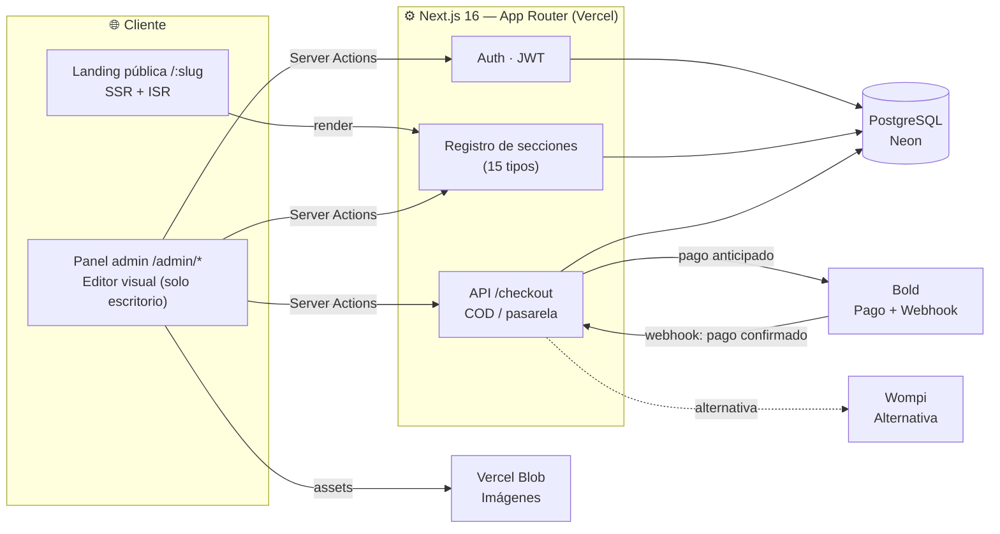

<div align="center">

# 🧭 Meridian

**Plataforma de landing pages de producto único con editor visual tipo Shopify y panel de administración**

Autenticación · Editor visual (drag & drop) · Landing pública SSR/ISR · Checkout COD y pasarela · Pedidos · Dashboard

### 🔗 [meridian-khaki-tau.vercel.app](https://meridian-khaki-tau.vercel.app)

[](https://nextjs.org/)
[](https://www.typescriptlang.org/)
[](https://react.dev/)
[](https://tailwindcss.com/)
[](https://neon.tech/)
[](https://orm.drizzle.team/)
[](https://vercel.com/)
[](#)

</div>

---

## 📌 Tabla de contenidos

- [Sobre el proyecto](#-sobre-el-proyecto)
- [Estado actual](#-estado-actual)
- [Arquitectura](#️-arquitectura)
- [Características](#-características)
- [Novedades recientes](#-novedades-recientes)
- [Stack técnico](#-stack-técnico)
- [Estructura del proyecto](#-estructura-del-proyecto)
- [Instalación rápida](#-instalación-rápida)
- [Variables de entorno](#-variables-de-entorno)
- [Despliegue](#-despliegue)
- [Mantenimiento continuo](#️-mantenimiento-continuo)

---

## Sobre el proyecto

**Meridian** es una plataforma para vender un producto único por landing, con un editor visual tipo Shopify y un panel de administración completo. Cada landing (`/:slug`) es una página autónoma sin navegación de salida, pensada para tráfico de anuncios: se construye como un JSON ordenado de secciones (hero, beneficios, testimonios, formulario de pedido, HTML personalizado…) que se edita arrastrando bloques y se renderiza en servidor con SSR/ISR.

El backend es **Next.js 16 (App Router)** con Server Components y Server Actions sobre **PostgreSQL** (Drizzle ORM), sin una API separada — un solo proyecto cubre panel, editor, landing pública y checkout.

## Estado actual

**La plataforma está finalizada y operando en producción**, vendiendo activamente en [meridian-khaki-tau.vercel.app](https://meridian-khaki-tau.vercel.app) con pago contra entrega y pago online (Bold). Todos los módulos core están completos y estables:

| Módulo | Estado |
|---|---|
| Autenticación de admin (Auth.js, JWT) | ✅ Operativo |
| Panel administrativo (productos, pedidos, dashboard) | ✅ Operativo |
| Editor visual de landings (drag & drop, autosave, publicar) | ✅ Operativo |
| Landing pública (SSR/ISR, SEO, píxeles) | ✅ Operativo |
| Checkout dual — contra entrega / pago online / ambos | ✅ Operativo |
| Pagos con Bold (botón embebido + webhook HMAC) | ✅ Operativo |
| Pagos con Wompi | ✅ Implementado como alternativa (no activo en producción) |
| Gestión de pedidos (estado + pago separados, línea de tiempo) | ✅ Operativo |

De aquí en adelante, el trabajo sobre el repositorio consiste en **nuevas implementaciones puntuales y corrección de bugs** que se detecten en producción, no en desarrollo de funcionalidades base. Detalle completo por etapa: [`docs/PLAN.md`](docs/PLAN.md) · Informe de avance: [`docs/INFORME.md`](docs/INFORME.md) · Guía de despliegue: [`docs/DEPLOY.md`](docs/DEPLOY.md).

## 🏗️ Arquitectura



## Características

<table>
<tr>
<td valign="top" width="50%">

### Landing pública

- Página única por producto (`/:slug`), sin navegación de salida, SSR + ISR
- 15 tipos de sección editables: hero, barra de confianza, beneficios, cómo funciona, galería, tabla comparativa, countdown, oferta, testimonios, FAQ, formulario de pedido, insignias de calidad, HTML sanitizado, CTA fija móvil, aviso de compra reciente
- Tipografía propia (Fraunces/Inter) y animaciones de scroll-reveal, aisladas del panel de admin
- SEO completo (`generateMetadata`, OG/Twitter/canonical), `robots.txt` + `sitemap.xml`
- Píxeles de Meta/TikTok/GA y checkout dual (contra entrega / pago online / ambos)

</td>
<td valign="top" width="50%">

### Panel de administración

- Login con credenciales (Auth.js, sesión JWT), acceso restringido a formato escritorio
- Editor visual tipo Shopify: secciones reordenables (drag & drop), panel de ajustes, preview en vivo, autosave, borrador → publicar
- CRUD de productos con imágenes por URL (carrete ilimitado) y CRUD de landings (duplicar, archivar, restaurar)
- Módulo de pedidos: estado logístico y estado de pago **independientes**, línea de tiempo de eventos, notas internas
- Dashboard con ventas del día, pedidos por estado y por landing
- Pago online por landing vía capa `PaymentProvider` (Bold activo, Wompi como alternativa)

</td>
</tr>
</table>

## Novedades recientes

> Con la plataforma en producción, esta sección funciona como changelog: nuevas implementaciones y correcciones de bugs encontrados sobre la marcha.

- **Imágenes de producto solo por URL:** se quitó la subida de archivos del formulario de productos (`/api/upload` fallaba en producción sin `BLOB_READ_WRITE_TOKEN` configurado) y se reemplazó por un campo de URL + botón "Agregar" que arma un carrete sin límite de imágenes, con el mismo patrón que ya usaba el editor de secciones desde la Etapa 9.
- **Admin bloqueado en celular:** entrar a `/admin/*` desde un móvil ahora muestra una página 404 en vez del panel — el acceso queda restringido a pantallas de proporción tipo escritorio (`≥1024px`). Implementado con un breakpoint CSS puro (mismo criterio que ya usaban sidebar/menú móvil), sin parpadeo de contenido ni dependencia de user-agent.
- **Rediseño de la landing pública (Etapa 9):** nuevo sistema de diseño (Fraunces/Inter, scroll-reveal) y 6 tipos de sección nuevos, aplicado al motor de secciones existente sin romper el theming por landing.
- **Corrección de raíz en el admin (Etapa 9):** `Menu.Item` de Base UI no tiene prop `onSelect` (a diferencia de Radix); el código lo usaba igual y TypeScript no marcaba error porque `onSelect` existe como evento nativo de selección de texto. Esto dejaba sin responder Eliminar/Duplicar/Archivar/Cerrar sesión/Agregar sección en todo el panel — corregido una sola vez en `DropdownMenuItem`.
- **Pasarela Bold en producción (Etapa 8):** botón embebido con firma de integridad y webhook HMAC verificado, checkout dual real (`cod` / `gateway` / `both`), formulario de pedido con datos reales de Colombia (departamento → ciudad dependiente) y estado de pedido/pago separados en el admin.

## Stack técnico

| Categoría | Tecnología |
|---|---|
| **Framework** | Next.js 16 (App Router, Server Components/Actions) + TypeScript |
| **UI** | Tailwind CSS 4 + shadcn/ui (Base UI) + lucide-react |
| **Base de datos** | PostgreSQL (Neon) + Drizzle ORM |
| **Autenticación** | Auth.js (next-auth v5) con credenciales, sesión JWT |
| **Validación** | Zod |
| **Drag & drop** | dnd-kit |
| **Almacenamiento de imágenes** | Vercel Blob (productos y editor usan URL directa) |
| **Pagos** | Bold (activo en producción) · Wompi (alternativa) · mock (desarrollo) |
| **Infraestructura** | Vercel (app) · Neon (base de datos) |

## 📁 Estructura del proyecto

```
src/
  app/
    page.tsx                 # Home pública
    (public)/
      layout.tsx              # Tipografía Fraunces/Inter de las landings (next/font, aislada del admin)
      public.css               # Animaciones de scroll-reveal (.lp-reveal, .lp-faq-a…)
      [slug]/                  # Landing pública (SSR/ISR + generateMetadata)
    not-found.tsx            # 404 (landing no publicada, rutas inexistentes)
    login/                   # Login del admin
    admin/
      (shell)/               # Panel: dashboard, productos, pedidos, landings — solo escritorio (≥1024px)
      landings/[id]/editor/  # Editor visual fullscreen
      landings/[id]/preview/ # Render del borrador para el iframe del editor
    api/
      auth/[...nextauth]/    # Endpoints de Auth.js
      checkout/              # Crea pedidos (COD y pasarela) + estado de pago
      webhooks/[provider]/   # Confirmación de pago (Bold/Wompi/mock)
      upload/                # Subida de imágenes (sin uso actual desde la UI; ver Notas técnicas)
  components/
    sections/                # Registro de secciones + componentes de render público
      registry.ts              # Mapa type → { componente, esquema Zod, defaults, label, ícono }
      icons.ts                # Íconos compartidos (benefits/trust-bar/quality) + opciones del editor
      reveal.tsx              # Wrapper de scroll-reveal (IntersectionObserver)
    editor/                  # Editor visual (shell, lista dnd, panel de ajustes, preview)
    admin/                   # Componentes del panel (productos con carrete de imágenes por URL)
    ui/                      # shadcn/ui
  db/
    schema.ts                # Esquema Drizzle (users, products, landings, orders…)
    migrations/
  lib/
    auth.ts, auth.config.ts  # Auth.js
    payments/                # Capa PaymentProvider (bold.ts, wompi.ts, mock.ts)
    landings.ts              # Consulta de landing publicada (memoizada)
    sanitize.ts              # Sanitización del HTML personalizado (sanitize-html)
    zod-schemas/sections.ts  # Esquemas de settings por tipo de sección
    zod-schemas/checkout.ts  # Esquema del formulario de pedido (compartido cliente/servidor)
    colombia-geo.ts          # Departamentos/ciudades de Colombia (select dependiente)
    countries.ts             # Países + indicativo telefónico (selector del formulario)
    storage.ts               # Almacenamiento de archivos (local en dev / Vercel Blob en prod)
    format.ts                # Formato de moneda/fechas
  proxy.ts                   # Protección de /admin/* (Next 16)
scripts/
  seed.ts                    # Seed del usuario admin
  seed-landing.ts            # Seed de producto + landing demo publicada
docs/
  PLAN.md                    # Plan del proyecto por etapas
  INFORME.md                 # Informe de avance
  DEPLOY.md                  # Guía de despliegue en Vercel
```

## 🚀 Instalación rápida

Requisitos: Node.js 20+ y una base de datos Postgres (Neon o Supabase).

```bash
# 1. Instalar dependencias
npm install

# 2. Variables de entorno
#    Copia .env.example a .env y completa DATABASE_URL y AUTH_SECRET
cp .env.example .env

# 3. Aplicar migraciones y crear el usuario admin
npm run db:migrate
npm run db:seed        # admin@meridian.local / admin1234 por defecto

# 4. Levantar el servidor
npm run dev            # http://localhost:3000
```

Para personalizar el usuario admin del seed:

```bash
ADMIN_EMAIL=tu@correo.com ADMIN_PASSWORD=TuClave ADMIN_NAME="Tu Nombre" npm run db:seed
```

### Scripts

| Comando | Descripción |
|---------|-------------|
| `npm run dev` | Servidor de desarrollo |
| `npm run build` | Build de producción |
| `npm run lint` | ESLint |
| `npm run db:generate` | Genera migraciones desde `src/db/schema.ts` |
| `npm run db:migrate` | Aplica migraciones a la BD |
| `npm run db:push` | Empuja el esquema sin migraciones (solo prototipos) |
| `npm run db:seed` | Crea/actualiza el usuario admin |
| `npm run db:seed:landing` | Crea/actualiza la landing demo publicada (`/botella-aurora`) |
| `npm run test:bold` | Verifica las firmas de Bold contra los ejemplos oficiales de su documentación |

## 🔐 Variables de entorno

| Variable | Obligatoria | Descripción |
|----------|-------------|-------------|
| `DATABASE_URL` | ✅ | Cadena de conexión Postgres (Neon/Supabase) |
| `AUTH_SECRET` | ✅ | Secreto de sesión (`npx auth secret`) |
| `AUTH_TRUST_HOST` | Solo `next start` fuera de Vercel | Ponla en `true` (Vercel la define sola) |
| `NEXT_PUBLIC_SITE_URL` | ✅ | URL pública del sitio |
| `ADMIN_EMAIL` / `ADMIN_PASSWORD` / `ADMIN_NAME` | — | Credenciales que usa `db:seed` |
| `NEXT_PUBLIC_CURRENCY` / `NEXT_PUBLIC_LOCALE` | — | Formato de precios (por defecto `COP` / `es-CO`) |
| `PAYMENT_PROVIDER` | Para pago online | `bold`, `wompi` (por defecto si hay llaves de Wompi) o `mock` (solo dev) |
| `BOLD_API_KEY` / `BOLD_SECRET_KEY` | Para Bold | Llaves del panel de Bold → Integraciones → Llaves de integración |
| `BOLD_SANDBOX` | Solo pruebas con llaves de Bold de test | `"true"`: Bold firma esos webhooks con llave vacía; nunca en producción |
| `WOMPI_PUBLIC_KEY` / `WOMPI_INTEGRITY_SECRET` / `WOMPI_EVENTS_SECRET` | Para Wompi | Llaves del panel de Wompi (sandbox: `pub_test_*`); registra `https://<dominio>/api/webhooks/wompi` como URL de eventos |
| `BLOB_READ_WRITE_TOKEN` | Para imágenes en producción | Token de Vercel Blob (`storage.ts` lo usa automáticamente si existe) |

> No se incluyen credenciales ni secretos en este repositorio.

## Despliegue

- **App** → Vercel ([meridian-khaki-tau.vercel.app](https://meridian-khaki-tau.vercel.app))
- **Base de datos** → PostgreSQL gestionada por Neon (región `sa-east-1`)
- **Imágenes** → Vercel Blob (`BLOB_READ_WRITE_TOKEN`); local en `public/uploads/` en desarrollo
- **Seguridad** → CSP, `nosniff`, `Referrer-Policy` y `Permissions-Policy` solo en producción; `/admin` protegido por `src/proxy.ts` y restringido a formato escritorio

Guía paso a paso, checklist post-deploy y notas de migraciones: [`docs/DEPLOY.md`](docs/DEPLOY.md).

## 🛠️ Mantenimiento continuo

La plataforma ya está lista para vender. El trabajo futuro no es un roadmap hacia un "producto terminado", sino mantenimiento continuo sobre una plataforma ya en producción:

- Corrección de bugs reportados en producción
- Implementaciones puntuales solicitadas sobre módulos existentes
- Ajustes de UX/UI y contenido a medida que se detecten oportunidades
- Mejoras de rendimiento, seguridad y observabilidad cuando aplique

### Notas técnicas

- **Next 16 usa `proxy.ts`** (no `middleware.ts`): la protección de `/admin/*` vive en `src/proxy.ts`.
- **shadcn/ui se basa en Base UI** (no Radix): los componentes se componen con la prop `render`, no con `asChild`. `DropdownMenuItem` acepta `onSelect` como alias de `onClick` (`src/components/ui/dropdown-menu.tsx`) porque el `Menu.Item` real de Base UI no expone `onSelect` — replica el mismo alias si agregas un componente Base UI nuevo con selección por ítem.
- **Imágenes:** tanto el editor de secciones como el formulario de productos usan **solo URL** (sin botón de subida) — pega el enlace directo de la imagen. `/api/upload` y `src/lib/storage.ts` (Vercel Blob) siguen en el repo pero sin llamadas activas desde la UI.
- **Admin solo en escritorio:** `src/app/admin/(shell)/layout.tsx` renderiza una página 404 por debajo de `1024px` de ancho (breakpoint `lg` de Tailwind) y el panel real desde ahí en adelante.
- **Precios** se guardan como `numeric(12,2)` en Postgres y se formatean con `Intl.NumberFormat` según `NEXT_PUBLIC_CURRENCY`/`NEXT_PUBLIC_LOCALE`.
- La documentación de esta versión de Next está en `node_modules/next/dist/docs/` — consúltala antes de asumir APIs de versiones anteriores.

---

<div align="center">

Plataforma en producción en [meridian-khaki-tau.vercel.app](https://meridian-khaki-tau.vercel.app). A partir de aquí, este repositorio evoluciona mediante nuevas implementaciones y corrección de bugs.

</div>
